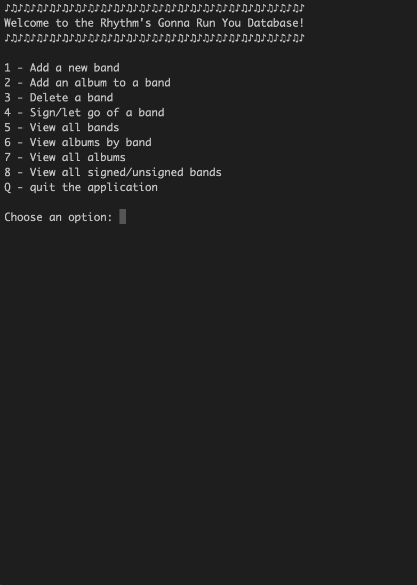

# 03-03 Rhythm's gonna get you

---

This console app integrates databases that keeps track of bands with the following information:

- Band Name
- Country of Origin
- Number of Members
- Band Website
- Style
- Signed Status
- Contact Name
- Contact Phone Number
- Albums
  - Album Title
  - Explicit
  - Release Date

The console app has these following features:

- Adding a band
- Adding an album
- Delete a band
- View all bands
- View all albums by a band
- Sign/Let a band go

Technologies used:

- C# with the .NET framework
- Entity Framework
- PostgreSQL

This project focuses on using C# to store various information in a database created using PostgreSQL. This demonstrates how backend databases are set up where it will eventually be called by a frontend to display data.

# Assignment Overview:

For this project, we will model and create a database. We are starting a record
label company, and we a place to store our bands, albums, and eventually songs.
You are creating a console app that stores our information in a database.

## Objectives

- Practice working with SQL
- Practice working with ORMs (EF Core)

## Setup

Create a console that allows a user to store and manage the company's bands,
albums, and (eventually) songs.

## Top Tips

Although in reality an album could be done by more than one band, our system
will just have an album involving **one** band. That is, an album belongs to one
band.

### Explorer Mode

- [x] Create a database that stores `Albums`, and `Bands`. They should have the following properties, use your best judgment for types. (We will add foreign keys in the next step)

  - [x] Album
    - Id
    - Title
    - IsExplicit
    - ReleaseDate
  - [x] Band

    - Id
    - Name
    - CountryOfOrigin
    - NumberOfMembers
    - Website
    - Style
    - IsSigned
    - ContactName
    - ContactPhoneNumber

  - Add foreign keys to fulfill the following

    - [x] One Band has many Albums

  - [x] Create an interface to let the user:

    - [x] Add a new band
    - [x] View all the bands
    - [x] Add an album for a band
    - [x] Let a band go (update isSigned to false)
    - [x] Resign a band (update isSigned to true)
    - [x] Prompt for a band name and view all their albums
    - [x] View all albums ordered by ReleaseDate
    - [x] View all bands that are signed
    - [x] View all bands that are not signed

### Adventure Mode

- [ ] Add the ability for an album to have many songs. **NOTE** a song will only belong to a single album. Even if the same-named song appears on different albums we'd have a second entry for it.

  - [ ] Song

    - Id
    - Title
    - Lyrics
    - Length
    - Genre

- [ ] Track the individual members of a band. Create a new table called
      `Musicians` and give it a many to many relationships with a Band
- Add the following queries
  - [ ] View albums in a genre
  - [ ] View all members of a band

### Epic Mode

- Add another entity that you feel would benefit the system. Update your ERD,
  tables and user interface to support it.

## Additional Resources

- [PostgreSQL Documentation](https://www.postgresql.org/docs/)
